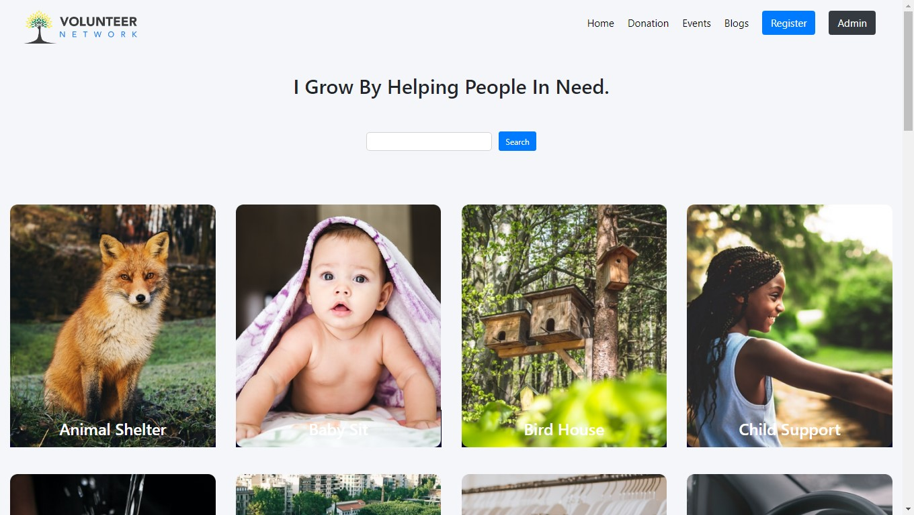

# Volunteer Network

[https://volunteer-network-react.web.app/](https://volunteer-network-react.web.app/)

A full-stack volunteer agency app where you can take any volunteer jobs that the agency offers.  User panel shows the voluntary jobs enrolled and user can delete any jobs if he doesnt wanna do it. separate admin panel for admins where they can see volunteer list and checkout their infos. 

## Features
- Selection of any volunteer jobs that the user wants to do
- Separate User and admin dashboard
- User Authentication using Google

## Technologies
- React
- React Context API
- React Router
- Bootstrap
- Node.js
- MongoDB
- Firebase Authentication
- Heroku
